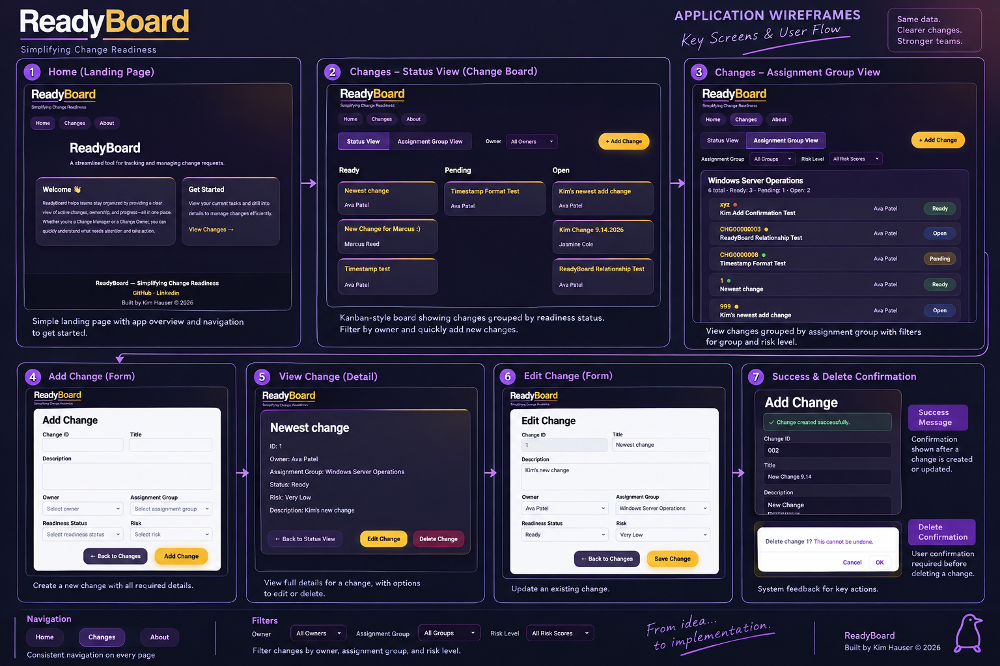
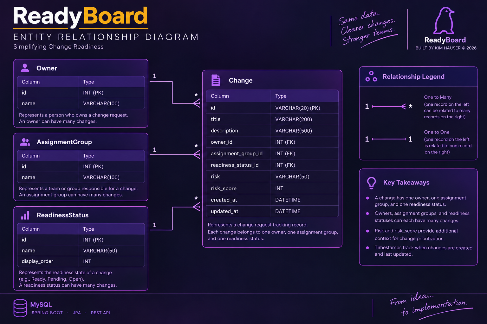

# ReadyBoard

ReadyBoard is a full-stack change management application designed to help teams quickly assess, prioritize, and manage changes based on readiness, ownership, assignment group, and risk. Built with React/JavaScript, Spring Boot/Java, Hibernate/JPA, and MySQL, ReadyBoard provides a centralized, highly scannable dashboard backed by persistent relational data and RESTful CRUD APIs.

Users can create, view, update, delete, and bulk-import changes, organize work through status- and assignment-based views, and dynamically filter the dashboard to surface information most relevant to operational decision-making.

Originally developed as a LaunchCode capstone project, ReadyBoard was inspired by real-world change management workflows and evolved through iterative development and user feedback, with an emphasis on usability, practical product design, and translating business needs into working software.

## ✨ Features

### Change Management

* Create, view, update, and delete change records
* View detailed information for individual changes
* Associate changes with owners, assignment groups, and readiness statuses
* Persist application data in a MySQL relational database

### 📥 CSV Change Import

* Import multiple change records from CSV files
* Preview parsed change data before importing
* Match owners, assignment groups, and readiness statuses to existing relational data
* Automatically calculate risk scores from imported risk levels
* Display success and error feedback during the import process

### 🔄 Multiple Dashboard Views

* **Status View** – Organizes changes by readiness/status for quick operational scanning
* **Assignment Group View** – Groups changes by team ownership and summarizes the distribution of work within each group

### 🎯 Risk-Based Prioritization

* Visual risk indicators for quick scanning
* Filter changes by risk level
* Surface higher-risk work without losing the context of the overall change landscape

### 🔍 Dynamic Filtering

Filter changes by:

* Assignment group
* Owner
* Risk level

Filters can be combined to narrow the dashboard to the work most relevant to the user.

### 🧩 Reusable Frontend Components

ReadyBoard uses reusable React components for common interface elements including:

* Change cards
* Filters
* Risk indicators
* Navigation and status controls
* Forms and change-management interactions

### 🔌 REST API Integration

The React frontend communicates with a Java Spring Boot backend through RESTful API endpoints. The backend handles application logic and persistence using Spring Data JPA/Hibernate with MySQL.

Core API resources include:

* `/api/changes`
* `/api/readiness-statuses`
* `/api/owners`
* `/api/assignment-groups`

Change operations support standard CRUD functionality using GET, POST, PUT, and DELETE requests.

---

### ✉️ Contact Form

* Submit feedback or contact messages directly through the About page
* Validate name, email, and message content on the client before submission
* Send form data asynchronously using the Fetch API
* Integrate with Formspree for form processing and email delivery
* Provide success and error feedback based on the submission response

---

### 📄 CSV Import Format

ReadyBoard supports bulk change creation using CSV files with the following headers:

`id,title,description,owner,assignmentGroup,readinessStatus,risk`

Owner, assignment group, and readiness status values must currently match existing records in the database. Rows containing unmatched lookup values will not be imported.

---

## 🛠️ Tech Stack

### Frontend

* React
* Vite
* JavaScript
* CSS
* React Router
* Fetch API
* Papa Parse – CSV parsing for change imports
* Formspree – Contact form processing and email delivery

### Backend

* Java
* Spring Boot
* Spring Data JPA
* Hibernate
* RESTful APIs

### Database

* MySQL

### Development & Deployment

* Git / GitHub
* Postman for API testing

---

## 🧠 Design Philosophy

ReadyBoard was designed around a few core principles:

**Clarity over complexity** – The interface prioritizes information users need to make decisions rather than exposing unnecessary detail.

**Scannability** – Status, ownership, and risk should be understandable at a glance.

**Real-world usability** – Features are inspired by actual operational and change-management workflows rather than being implemented solely to demonstrate technical concepts.

**Flexible workflows** – Different users may care about different dimensions of the same data, so ReadyBoard provides multiple views and filtering options.

**Iterative product development** – Features and interface decisions evolved through testing, feedback, and repeated refinement throughout development.

---

## 🏗️ Architecture

ReadyBoard uses a traditional full-stack architecture:

`React / Vite → REST API → Spring Boot → Hibernate / JPA → MySQL`

The frontend is responsible for presentation, navigation, filtering, and user interaction. Spring Boot exposes REST endpoints and handles application logic, while Hibernate/JPA maps Java entities to relational data stored in MySQL.

Core application entities include:

* Change
* Owner
* Assignment Group
* Readiness Status

Relationships between these entities allow change records to reference reusable ownership, team, and readiness information rather than storing duplicate values.

The contact form uses a separate lightweight integration:

`React → Fetch API → Formspree → Email`

This allows contact submissions to be processed and delivered without requiring ReadyBoard's backend to manage email infrastructure.

---

## 📐 Project Documentation

### Wireframes

Initial wireframes used to plan ReadyBoard's dashboard, navigation, and change-management workflows:



### ER Diagram

ReadyBoard's relational data model includes Change, Owner, Assignment Group, and Readiness Status entities:



---

## 🚀 Running ReadyBoard Locally

ReadyBoard uses a **React/Vite frontend** and a **Spring Boot backend** with Hibernate/JPA and MySQL persistence.

### Prerequisites

* Java
* Node.js and npm
* MySQL
* Git

### Backend

Navigate to the backend directory:

```
cd backend
```

Configure the local database connection:

```
Database URL: jdbc:mysql://localhost:3306/readyboard
Username: readyboard_user
Password: [your local database password]
```

Install/build the backend dependencies and start Spring Boot:

```
./mvnw clean install
./mvnw spring-boot:run
```

The backend runs on embedded Tomcat and serves the REST API at:

```
http://localhost:8080
```

### Frontend

In a separate terminal:

```
cd frontend
npm install
npm run dev
```

The Vite development server is typically available at:

```
http://localhost:5173
```

Both the backend and frontend should be running to use the full application locally.

---

## 🌐 Deployment

Full-stack deployment is planned as a future enhancement.

---

## 🔮 Current Limitations & Future Enhancements

Potential future enhancements include:

- Full-stack deployment
- Automatically create missing owners and assignment groups during CSV import
- Expanded validation and import error handling
- Persistent user filter preferences
- Additional reporting and summary views
- Authentication and role-based access
- Expanded readiness and change-management workflows

---

## 📚 What I Learned

Building ReadyBoard provided hands-on experience with:

* Designing and building a full-stack application
* Connecting a React frontend to a Spring Boot REST API
* Implementing CRUD operations across the application stack
* Designing relational data models with MySQL
* Using JPA/Hibernate to manage entity relationships and persistence
* Managing asynchronous API requests and React state
* Parsing and validating CSV data in a React application
* Mapping imported human-readable values to relational database entities
* Building reusable React components
* Designing forms and validating user input
* Testing REST endpoints with Postman
* Debugging frontend, backend, database, and CORS issues
* Translating user feedback into functional features
* Iterating on UI and product decisions as requirements evolved

---

## 💬 Why I Built This

ReadyBoard began as a class project but evolved into a tool inspired by real workplace needs. I wanted to explore how software could make change information easier to understand without requiring users to dig through dense tables or multiple systems.

Feedback from colleagues influenced features such as risk filtering, assignment-group views, and the overall emphasis on quickly determining whether work is ready to proceed. As the project grew from a frontend prototype into a full-stack application, it also became an opportunity to practice translating operational problems into data models, APIs, user interfaces, and working software.

---

## 👤 Author

Built by **Kim Hauser**

* LaunchCode Women+ Software Development Cohort participant
* IT Product Administrator
* Exploring full-stack software development, product design, and internal tooling

---

## 📝 License

ReadyBoard was created for educational and portfolio purposes.
